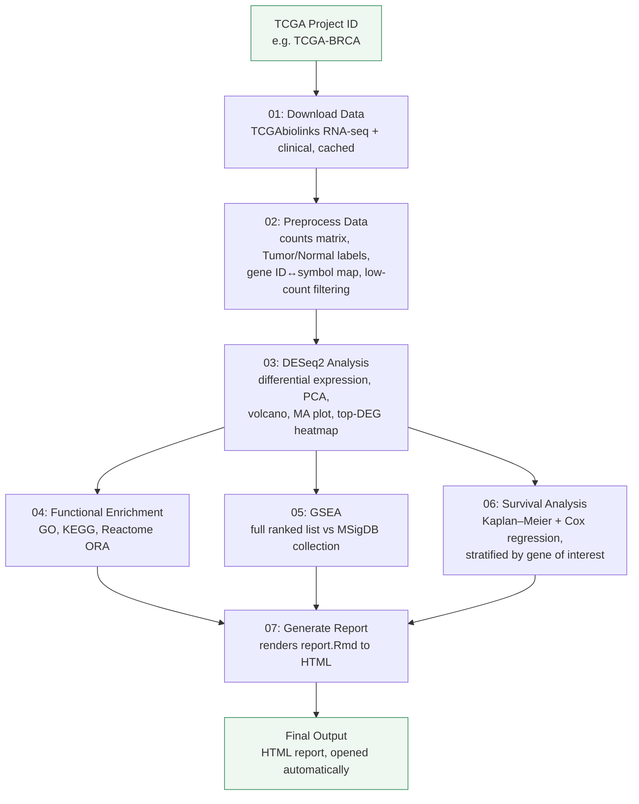

<p align="center">
  
</p>

<p align="center">
  A reproducible, config-driven R pipeline for TCGA transcriptomic analysis —
  from raw counts to differential expression, functional enrichment, and survival outcomes.
</p>

---

## Overview

MINT 1.0.0 takes a TCGA project (e.g. TCGA-BRCA, TCGA-LUSC) from raw expression data through
a full differential expression and survival analysis workflow, producing a self-contained
HTML report at the end. It was built around a single BRCA analysis and generalized so the
same pipeline can be pointed at other TCGA cohorts by changing a config file, not the code.

**Core capabilities:**
- Automated TCGA RNA-seq counts + clinical data acquisition and caching (via `TCGAbiolinks`)
- Automatic Tumor/Normal label inference and low-count gene filtering, with a warning if too few Normal samples are available
- Differential expression analysis (`DESeq2`), with PCA, dispersion, volcano, MA plot, and top-DEG heatmap
- Functional enrichment: GO (Biological Process), KEGG, and Reactome over-representation analysis on up/down DEGs
- Gene-set enrichment analysis (GSEA) against an MSigDB collection
- Survival analysis: Kaplan–Meier curves plus univariate (and multivariate, where clinical covariates allow) Cox proportional hazards, stratified by a gene of interest
- A single auto-rendered HTML report (`report.Rmd`) embedding every plot and table, opened automatically on completion
- Checkpointed, segment-by-segment execution — rerun one stage without repeating the rest

## Workflow



Each numbered stage lives in its own script under `R/`, run in sequence by `run_pipeline.R`.
Shared helper functions live in `utils.R`. Intermediate objects are cached, so any stage can
be re-run independently after a fix without repeating earlier steps.

## Project structure

```
MINT/
├── run_pipeline.R              # driver — sources R/01 through R/07
├── config.R                    # all user-editable settings (project ID, cutoffs, gene of interest)
├── report.Rmd                  # R Markdown template rendered by 07
├── data/                      # all data files (creates on run automatically)
├── R/
│   ├── 01_download_data.R        # TCGAbiolinks download + cache (RNA-seq + clinical)
│   ├── 02_preprocess_data.R      # counts matrix, Tumor/Normal labels, gene ID↔symbol map, filtering
│   ├── 03_deseq2_analysis.R      # DESeq2 DE, PCA, dispersion, volcano, MA plot, top-DEG heatmap
│   ├── 04_functional_enrichment.R # GO (BP), KEGG, Reactome ORA on up/down DEGs
│   ├── 05_gsea_analysis.R        # GSEA on the full ranked gene list vs an MSigDB collection
│   ├── 06_survival_analysis.R # Kaplan–Meier + Cox PH, stratified by gene of interest
│   ├── 07_generate_report.R      # renders report.Rmd to HTML, opens it automatically
│   └── utils.R                     # shared helper functions used across stages
├── assets/
│   └── mint_logo.png
├── results/                     # figures, tables, and the rendered report land here (creates on run automatically)
└── README.md
```

## Requirements

- R (≥ 4.2 recommended)
- Bioconductor: `DESeq2`, `TCGAbiolinks`, `clusterProfiler`, `ReactomePA`, `EnhancedVolcano`, `org.Hs.eg.db`
- CRAN: `survival`, `survminer`, `msigdbr`, `ggplot2`, `dplyr`, `rmarkdown`

## Installation

```bash
git clone https://github.com/riffatnaz/MINT.git
cd MINT
```

Then, in R:

```r
install.packages(c("tidyverse", "survival", "ashr", "survminer", "msigdbr", "rmarkdown", "flextable"))
if (!require("BiocManager", quietly = TRUE)) install.packages("BiocManager")
BiocManager::install(c("DESeq2", "TCGAbiolinks", "SummarizedExperiment", "clusterProfiler", "enrichplot", "ReactomePA", "EnhancedVolcano", "org.Hs.eg.db", "apeglm", "fgsea", "pheatmap"))
```

## Usage

1. Open `config.R` and set your TCGA project ID, significance cutoffs (`PVAL_CUTOFF`,
   `LFC_CUTOFF`), and gene of interest.
2. Run the pipeline:

```r
source("run_pipeline.R")
```

3. On completion, the HTML report opens automatically from `Results/`, alongside all
   figures and result tables generated along the way.

## Adapting to a new dataset

MINT was validated on TCGA-BRCA and TCGA-LUSC. To point it at a different TCGA project,
change the project ID in `config.R` — no code changes required. GEO-dataset support is
kept in mind structurally but not yet implemented.

## Acknowledgements

MINT is built on the shoulders of several open-source R/Bioconductor packages:

- [TCGAbiolinks](https://bioconductor.org/packages/TCGAbiolinks/) — TCGA data query and download
- [DESeq2](https://bioconductor.org/packages/DESeq2/) — differential expression analysis
- [clusterProfiler](https://bioconductor.org/packages/clusterProfiler/) — GO and KEGG over-representation and GSEA
- [ReactomePA](https://bioconductor.org/packages/ReactomePA/) — Reactome pathway enrichment
- [msigdbr](https://cran.r-project.org/package=msigdbr) — MSigDB gene sets for GSEA
- [fgsea](https://bioconductor.org/packages/release/bioc/html/fgsea.html) — fast pre-ranked gene set enrichment
- [survival / survminer](https://cran.r-project.org/package=survminer) — Kaplan–Meier and Cox proportional hazards modeling
- [EnhancedVolcano](https://bioconductor.org/packages/EnhancedVolcano/) — volcano plot visualization
- [rmarkdown](https://rmarkdown.rstudio.com/) — automated HTML report generation

## License

MIT License  see `LICENSE` for details.

## Reach Out

**Riffat Naz** — [GitHub](https://github.com/riffatnaz)  — [LinkedIn](https://www.linkedin.com/in/riffat-naz/)
